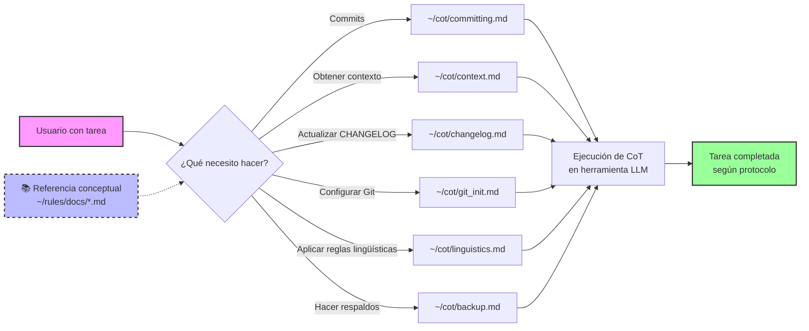

# Reglas técnicas: prompts y CoT para acelerar el contexto de los LLM

[](https://www.gnu.org/licenses/gpl-3.0)
[](http://commonmark.org)
[-green.svg)](https://es.wikipedia.org/wiki/Espa%C3%B1ol_mexicano)
[](./ROADMAP.md)

Definiciones rápidas

- Prompt: instrucción o contexto que le das al modelo para indicarle qué hacer, con qué tono y bajo qué restricciones.
- CoT (Chain-of-Thought): cadena de razonamiento paso a paso que hace explícito cómo se llega a una respuesta, útil para tareas complejas.

Este repositorio contiene las reglas, estándares y filosofía que guían el trabajo técnico y la colaboración en los proyectos de Rodrigo Álvarez. En la práctica diaria se prioriza el uso de los CoT: los documentos describen la lógica de las reglas, pero las herramientas de trabajo cotidianas son los CoT en sí.

## Filosofía principal

Un manifiesto contra tres males endémicos en tecnología latinoamericana:

- **Mercenazgo:** trabajos mediocres sin compromiso real
- **Egoísmo técnico:** acaparar conocimiento para crear dependencia
- **Falta de identidad:** complejos culturales que degradan la calidad

### Contexto académico relacionado

- La idea de usar este repositorio como contexto instruccional para LLM se alinea con la línea de investigación «chain-of-thought prompting», que muestra que proporcionar cadenas de razonamiento mejora el desempeño en tareas complejas.
- Referencia: Jason Wei et al., «Chain-of-Thought Prompting Elicits Reasoning in Large Language Models», arXiv:2201.11903. DOI: [10.48550/arXiv.2201.11903](https://doi.org/10.48550/arXiv.2201.11903) (resumen: [arXiv:2201.11903](https://arxiv.org/abs/2201.11903)).

## Flujo de trabajo diario con CoT (recomendado)

Principio operativo: los documentos de `docs/` contienen la lógica y las reglas; sin embargo, las herramientas de trabajo del día a día son los CoT ubicados en `prompts/cot/`.

### Configuración inicial (una sola vez)

**Comandos paso a paso**:

```bash
# Linux y macOS
git clone git@github.com:incognia/rules.git ~/rules
ln -s ~/rules/prompts/cot cot
```

**Notas**:
- Este flujo funciona muy bien en macOS y Linux
- Si el enlace ya existe, puedes recrearlo:

```bash
rm -f ~/cot && ln -s ~/rules/prompts/cot cot
```

### Uso diario



**Ejemplos de invocación**:

- `Aplica ~/cot/committing.md`
- `Aplica ~/cot/context.md`
- `Aplica ~/cot/changelog.md`

**Principio clave**: prioriza siempre los CoT para ejecución; usa los documentos de `docs/` como referencia conceptual.

## Documentos incluidos

- **[PHILOSOPHY.md](./PHILOSOPHY.md)** - filosofía principal y manifiesto de desarrollo
- **[PROMPTS.md](./PROMPTS.md)** - guía de Chain-of-Thought (CoT) en es_MX
- **[ROADMAP.md](./ROADMAP.md)** - ruta de 90 días para CoT y automatizaciones
- **[TODO.md](./docs/TODO.md)** - tareas tácticas inmediatas (CoT y mejoras)
- **[CORPORATE.md](./docs/CORPORATE.md)** - perfil profesional corporativo
- **[TEACHING.md](./docs/TEACHING.md)** - perfil educativo y de divulgación científica
- **[ATTRIBUTION.md](./docs/ATTRIBUTION.md)** - reglas de atribución personal
- **[COMMITTING.md](./docs/COMMITTING.md)** - reglas para mensajes de *commit* y gestión de cambios
- **[GIT.md](./docs/GIT.md)** - configuración inicial de cuentas GitHub y GitLab
- **[LICENSING.md](./docs/LICENSING.md)** - reglas de licenciamiento para proyectos
- **[LINGUISTICS.md](./docs/LINGUISTICS.md)** - reglas lingüísticas de español mexicano como referente
- **[STYLING.md](./docs/STYLING.md)** - reglas de estilo para documentos Markdown (proyectos laborales)
- **[BACKUPS.md](./docs/BACKUPS.md)** - políticas de respaldos y operaciones destructivas
- **[GLOSSARY.md](./docs/GLOSSARY.md)** - glosario técnico de términos empleados
- **[CHANGELOG.md](./CHANGELOG.md)** - historial de cambios del proyecto

## Especialización técnica

- ingeniería DevOps con enfoque en Kubernetes nativo
- plataformas *bare-metal* sobre Proxmox VE
- GitOps y automatización declarativa
- observabilidad y mallas de servicios
- seguridad en entornos distribuidos

## Flujo de decisión para aplicación de reglas

La mayoría de las reglas en este repositorio tienen una **dualidad de contextos** (personal vs laboral). El flujo de decisión para determinar qué reglas aplicar es el siguiente:

### 1. Identificación del contexto del proyecto

- 💼 **Contexto laboral**: proyectos desarrollados para o bajo contrato con **Promad Business Solutions**
- 📺 **Contexto personal**: proyectos independientes, experimentales o de desarrollo personal

### 2. Aplicación de reglas por contexto

| Aspecto | Personal (`@incognia`) | Laboral (`@incogniadev`) |
|---------|------------------------|---------------------------|
| **Licenciamiento** | GPLv3 (copyleft) | MIT (permisiva) |
| **Autoría** | Rodrigo Álvarez (@incognia) | Rodrigo Álvarez (@incogniadev) |
| **Email** | [incognia@gmail.com](mailto:incognia@gmail.com) | [ralvarez@promad.com.mx](mailto:ralvarez@promad.com.mx) |
| **SSH Key** | ~/.ssh/id_ed25519 | ~/.ssh/promad_ed25519 |
| **Estilo de documentos** | No definido aún | [STYLING.md](./docs/STYLING.md) aplicable |
| **Idioma documentación** | Español mexicano | Español mexicano |
| **Idioma código/commits** | Inglés internacional | Inglés internacional |

### 3. Reglas universales (aplican a ambos contextos)

- **LINGUISTICS.md**: español mexicano como estándar cultural
- **COMMITTING.md**: Conventional Commits en inglés
- **PHILOSOPHY.md**: principios generales de trabajo
- **BACKUPS.md**: políticas de respaldos y operaciones destructivas
- **GLOSSARY.md**: términos técnicos estandarizados
- **GIT.md**: configuración inicial de repositorios

### 4. Reglas de uso dual (diferentes aplicaciones según contexto)

- **LICENSING.md**: define qué licencia usar según el contexto (personal: GPLv3, laboral: MIT)
- **CORPORATE.md**: perfil profesional adaptado a cada entorno
- **TEACHING.md**: perfil educativo y de divulgación (contexto personal)

### 5. Reglas de uso exclusivamente personal

- **ATTRIBUTION.md**: atribución personal en documentos/scripts individuales

### 6. Reglas de uso exclusivamente laboral

- **STYLING.md**: reglas de estilo para documentos Markdown corporativos

## Prompts (Chain-of-Thought) y estructura

- Índice general: ver [PROMPTS.md](./PROMPTS.md)
- Estructura: [prompts/README.md](./prompts/README.md)
  - CoT: [prompts/cot](./prompts/cot)
  - Templates: [prompts/templates](./prompts/templates)
  - Guides: [prompts/guides](./prompts/guides)
  - Actions: [prompts/actions](./prompts/actions)
  - Snippets: [prompts/snippets](./prompts/snippets)

## Herramientas y scripts

- Git (post init): scripts/git-init-context.sh
- Backups:
  - scripts/backup_file.sh (archivos/directorios, .tar.zst, checksum >=100 MB, log CST)
  - scripts/backup_rsync_snapshot.sh (incrementales diarios con rsync --link-dest)
  - scripts/verify_backups.sh (verificación masiva de .sha256)

## Cómo usar CoT rápidamente

- Guía: lee [PROMPTS.md](./PROMPTS.md)
- Ejemplos: carpeta [prompts/cot/](./prompts/cot/)
- Buenas prácticas lingüísticas: [LINGUISTICS.md](./docs/LINGUISTICS.md)
- Flujo de commits y CHANGELOG: [COMMITTING.md](./docs/COMMITTING.md)
- **Nuevo**: CoT genérico para obtener contexto de proyectos: [prompts/cot/context.md](./prompts/cot/context.md)
- **Nuevo**: CoT para mantenimiento de CHANGELOG: [prompts/cot/changelog.md](./prompts/cot/changelog.md)
- **Mejorado**: CoT de commits con validación SSH: [prompts/cot/committing.md](./prompts/cot/committing.md)


### Nota de renderizado para CoT

Si tu CoT incluye front matter (bloque delimitado por `---` al inicio), para que se renderice bien con markdownlint agrega inmediatamente después del cierre del front matter esta línea para desactivar MD041 (H1 en la primera línea):

```markdown
---
domain: ...
...
---
<!-- markdownlint-disable MD041 -->
```

## Convenciones de fechas/horas

- Formato: 24 horas, zona «CST (Ciudad de México)».
- **CRÍTICO**: No rotular «CST» a horas UTC sin cálculo; CST = UTC - 6 horas.
- **Verificación obligatoria**: usar `TZ=America/Mexico_City date` para obtener tiempo real.
- Zona a usar en scripts: TZ=America/Mexico_City.
- CHANGELOG.md: solo fecha (YYYY-MM-DD), sin hora.

Más detalles: ver [LINGUISTICS.md – Fechas y horas (CST Ciudad de México)](./docs/LINGUISTICS.md#fechas-y-horas-cst-ciudad-de-méxico).

Ejemplos de comandos

```bash
# Fecha (CST) para CHANGELOG.md
TZ=America/Mexico_City date +"%Y-%m-%d"

# Fecha y hora (CST) legible
TZ=America/Mexico_City date '+%F %H:%M %Z'
LC_TIME=es_MX.UTF-8 TZ=America/Mexico_City date '+%d de %B de %Y, %H:%M (%Z)'

# Verificar cálculo correcto comparando UTC vs CST
echo "UTC: $(date -u '+%H:%M')" && echo "CST: $(TZ=America/Mexico_City date '+%H:%M')"
```

Ejemplos de conversión UTC → CST:

- UTC 14:30 → CST 08:30 (14 - 6 = 8)
- UTC 03:15 → CST 21:15 (día anterior, 03 - 6 = -3, entonces 24 - 3 = 21)

## Uso

Estos documentos sirven como referencia para mantener consistencia en:

- metodologías de trabajo técnico
- estándares de infraestructura y documentación
- políticas de licenciamiento
- convenciones lingüísticas y culturales
- aplicación correcta de reglas según el contexto del proyecto

---

*Este proyecto fue elaborado por Rodrigo Álvarez (@incognia) y se distribuye bajo la licencia GPLv3. Para más detalles, consulta el archivo LICENSE.*

*Copyright © 2026, Rodrigo Ernesto Álvarez Aguilera. Este es software libre bajo los términos de la GNU General Public License v3.*
