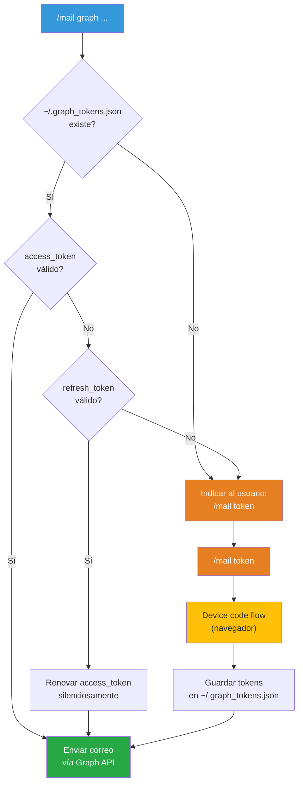

# Envío de correo HTML desde CLI

## Propósito

Documenta los tres flujos disponibles para componer y enviar correos HTML desde la terminal usando las plantillas OWA del repositorio. Cada modo resuelve un escenario distinto según el sistema operativo y el nivel de automatización.

## Modos de envío

- **`owa`** — genera el HTML y lo guardas como archivo. Abres en el navegador, copias (Ctrl+A → Ctrl+C) y pegas en Outlook Web. Funciona en cualquier OS.
- **`mac`** — genera el HTML y abre un borrador en Microsoft Outlook vía AppleScript. Outlook inyecta la firma «Kabat One» automáticamente. Envías con ⌘+Enter. Solo macOS.
- **`graph`** — genera el HTML y lo envía directamente vía Microsoft Graph API con OAuth2. Incluye la firma como imagen *inline* (CID). Funciona en cualquier OS.

## Prerrequisitos

**Todos los modos:**
- Plantillas HTML en `~/rules/templates/mail/` (`delivery_template.html` y `generic_template.html`)
- Reglas de composición en `~/rules/rulesets/MAIL.md`

**Modo `mac` (adicional):**
- macOS con Microsoft Outlook instalado y configurado
- Firma «Kabat One» como firma predeterminada en Outlook

**Modo `graph` (adicional):**
- Cuenta de Microsoft 365 con buzón activo (por ejemplo, `ralvarez@kabatone.com`)
- Aplicación registrada en Microsoft Entra (ver pasos abajo)
- Python 3 y `curl` instalados
- Imagen de firma en `~/rules/templates/mail/assets/ralvarez_firma_740.png`
- Credenciales en `~/.secrets.yaml` bajo la clave `GRAPH_API`

---

## Modo `owa` — copiar y pegar en Outlook Web

1. Genera el HTML con la plantilla correspondiente (entrega o genérica)
2. Guarda el archivo como `YYYY-MM-DD-{nombre-corto}.html` (fecha CST)
3. Copia la imagen de firma junto al HTML en una subcarpeta `assets/`
4. Abre el archivo en el navegador
5. Selecciona todo (Ctrl+A), copia (Ctrl+C) y pega en la ventana de composición de OWA
6. Outlook Web agrega la firma configurada automáticamente al enviar

> **Nota:** no incluyas la firma en el HTML; OWA la inyecta sola.

---

## Modo `mac` — borrador en Outlook vía AppleScript

1. Genera el HTML con la plantilla correspondiente
2. Guarda el archivo como `YYYY-MM-DD-{nombre-corto}.html` (fecha CST)
3. Abre un borrador en Microsoft Outlook con AppleScript:

```applescript
tell application "Microsoft Outlook"
    activate
    set newMsg to make new outgoing message with properties {subject:"...", content:"..."}
    make new to recipient at newMsg with properties {email address:{address:"destinatario@ejemplo.com"}}
    open newMsg
end tell
```

4. Outlook inyecta la firma «Kabat One» (con imagen embebida) automáticamente
5. Revisa el correo y envía con ⌘+Enter

> **Nota:** no incluyas la firma en el HTML. Usa `open` (no `send`) para que Outlook la inyecte. El envío directo con `send` no agrega la firma.

---

## Modo `graph` — envío directo vía Microsoft Graph API

### Dimensiones del contenedor

- Tabla exterior: `width="800"` con `max-width:800px`
- *Padding* del `<td>` interior: 30px por lado
- Área útil de contenido: **740px** (800 − 30 − 30)
- La firma debe medir 740px de ancho para llenar el área útil sin desbordar

### Firma

Microsoft Graph no inyecta la firma configurada en Outlook. Debes incluir la imagen de firma como adjunto *inline* con `contentId` y referenciarla en el HTML con `cid:`:

- **Archivo**: `~/rules/templates/mail/assets/ralvarez_firma_740.png` (740px de ancho)
- **Variantes disponibles**: `ralvarez_firma.png` (original), `_740.png`, `_800.png`, `_1024.png`

```html
<hr style="margin:30px 0; border:none; border-top:2px solid #ecf0f1;">

```

### Configuración inicial (una sola vez)

## Paso 1: registra la aplicación en Microsoft Entra

1. Abre [entra.microsoft.com](https://entra.microsoft.com) e inicia sesión con tu cuenta corporativa
2. Ve a **Entra ID → Registros de aplicaciones → Nuevo registro**
3. Completa el formulario:
   - **Nombre**: `Warp Mail CLI`
   - **Tipos de cuenta compatibles**: «Solo inquilino único» (tu organización)
   - **URI de redirección**: déjalo vacío
4. Haz clic en **Registrar**
5. Copia estos valores de la página de información general:
   - **Id. de aplicación (cliente)**: tu `CLIENT_ID`
   - **Id. de directorio (inquilino)**: tu `TENANT_ID`

## Paso 2: agrega permisos de API

1. En la aplicación registrada, ve a **Permisos de API**
2. Haz clic en **Agregar un permiso → Microsoft Graph → Permisos delegados**
3. Busca y agrega los siguientes permisos:
   - `Mail.Send` — enviar correo como usuario
   - `email` — ver la dirección de correo electrónico
   - `User.Read` — iniciar sesión y leer el perfil

Los tres permisos deben quedar como **Delegada** y con **«No»** en la columna «Se necesita consentimiento de administrador».

## Paso 3: habilita flujos de cliente público

1. Ve a **Autenticación** en el menú lateral de la aplicación
2. Abre la pestaña **Configuración**
3. Activa **«Permitir flujos de clientes públicos»** → **Habilitado**
4. Haz clic en **Guardar**

> **Nota:** si el *toggle* no guarda correctamente (error `invalid_client` al autenticar), ve a **Manifiesto**, busca `"allowPublicClient"` y cámbialo a `true` manualmente.

## Paso 4: autenticación por *device code flow*

Desde la terminal, solicita un código de dispositivo:

```bash
curl -s -X POST \
  "https://login.microsoftonline.com/$TENANT_ID/oauth2/v2.0/devicecode" \
  -d "client_id=$CLIENT_ID" \
  -d "scope=https://graph.microsoft.com/Mail.Send"
```

La respuesta incluye un `user_code` y un `device_code`. Abre la URL indicada (`https://login.microsoft.com/device`), ingresa el código de usuario y autentica con tu cuenta.

Después, canjea el `device_code` por un *token* de acceso:

```bash
curl -s -X POST \
  "https://login.microsoftonline.com/$TENANT_ID/oauth2/v2.0/token" \
  -d "grant_type=urn:ietf:params:oauth:grant-type:device_code" \
  -d "client_id=$CLIENT_ID" \
  -d "device_code=$DEVICE_CODE"
```

La respuesta contiene un `access_token` válido (típicamente por una hora) y un `refresh_token` para renovarlo.

## Paso 5: envía correo vía Microsoft Graph

Usa el *endpoint* `/me/sendMail` con el *token* obtenido:

```bash
curl -s -X POST "https://graph.microsoft.com/v1.0/me/sendMail" \
  -H "Authorization: Bearer $ACCESS_TOKEN" \
  -H "Content-Type: application/json" \
  -d '{
    "message": {
      "subject": "Asunto del correo",
      "body": {
        "contentType": "HTML",
        "content": "<html><body>Contenido HTML</body></html>"
      },
      "toRecipients": [
        {"emailAddress": {"address": "destinatario@ejemplo.com"}}
      ],
      "attachments": [
        {
          "@odata.type": "#microsoft.graph.fileAttachment",
          "name": "ralvarez_firma.png",
          "contentType": "image/png",
          "contentBytes": "<BASE64_DE_LA_IMAGEN>",
          "contentId": "firma_ralvarez",
          "isInline": true
        }
      ]
    },
    "saveToSentItems": true
  }'
```

En el HTML del correo, referencia la firma como imagen *inline*:

```html

```

---

## Valores de la aplicación registrada

Los valores de `CLIENT_ID`, `TENANT_ID` y demás parámetros de la aplicación están en `~/.secrets.yaml` bajo la clave `GRAPH_API`.

---

## Ciclo de vida del *token*

El script `scripts/graph_auth.py` gestiona la autenticación con caché en `~/.graph_tokens.json`.



### Periodicidad

- **`access_token`**: expira en ~1 hora. Se renueva automáticamente con el `refresh_token`.
- **`refresh_token`**: expira en ~90 días. Cuando expira, debes ejecutar `/mail token` de nuevo.
- **Uso diario**: nunca te pide autenticación. El `refresh_token` se renueva cada vez que se usa.
- **Primer uso o después de 90 días sin uso**: ejecuta `/mail token` para reautenticar.

### Archivos involucrados

- **`scripts/graph_auth.py`** — lógica de autenticación (caché → *refresh* → *device code*)
- **`~/.graph_tokens.json`** — caché de tokens (permisos 600, no se versiona)
- **`~/.secrets.yaml`** — `CLIENT_ID` y `TENANT_ID` bajo la clave `GRAPH_API`

---

## Notas técnicas

- **SMTP AUTH**: deprecado por Microsoft a partir del 1 de marzo de 2026, con deshabilitación completa el 30 de abril de 2026. El modo `graph` es el reemplazo oficial.
- **Firma en cada modo**: `owa` y `mac` delegan la firma a Outlook; `graph` la incluye como adjunto *inline* CID.
- **Plantillas HTML**: las reglas de composición (estilos *inline*, `bgcolor` en `<td>`, sin CSS externo) están en `rulesets/MAIL.md`.
- **Invocación**: usa el *skill* `/mail <token|owa|mac|graph> <delivery|generic> <asunto>`.

---

## Referencias

- Reglas de composición HTML: `~/rules/rulesets/MAIL.md`
- CoT de composición y entrega: `~/rules/cot/mail.md`
- *Skill*: `~/rules/.agents/skills/mail/SKILL.md`
- Script de autenticación: `~/rules/scripts/graph_auth.py`
- Plantillas: `~/rules/templates/mail/`

---

*Elaborado por Rodrigo Álvarez (@incognia)*
