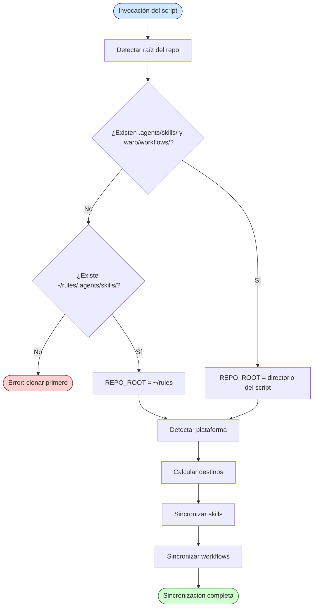
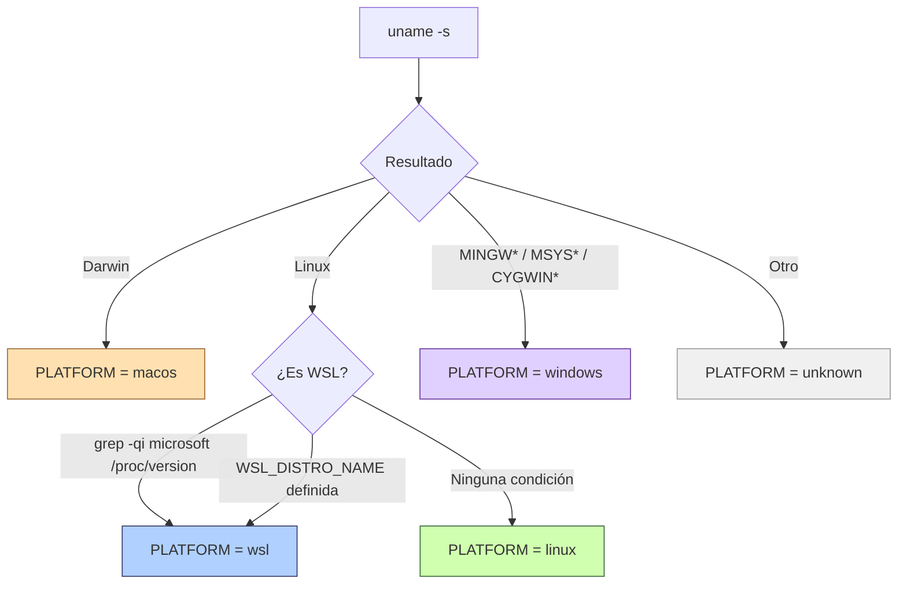
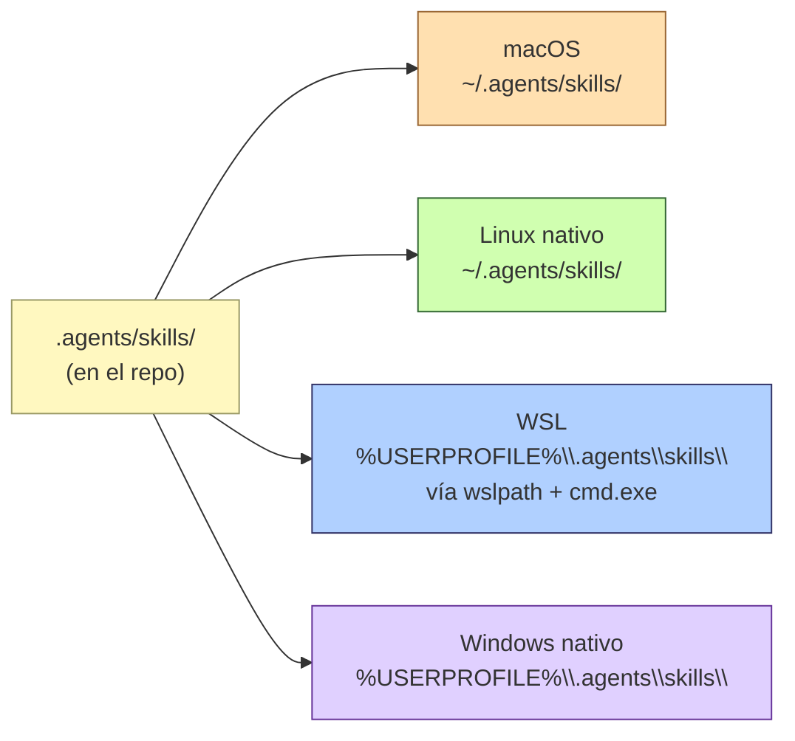
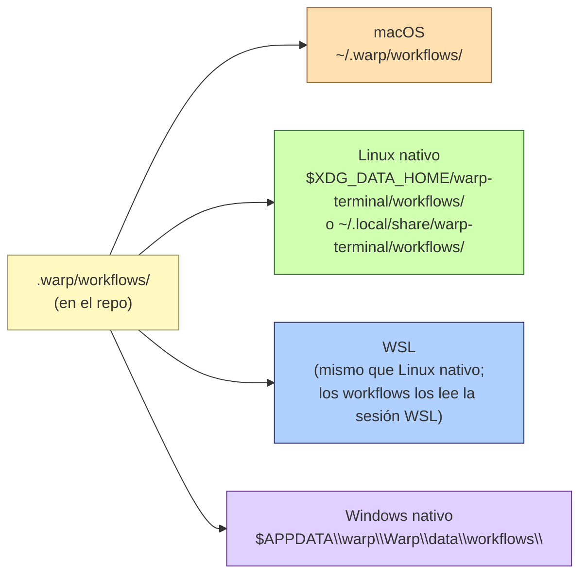
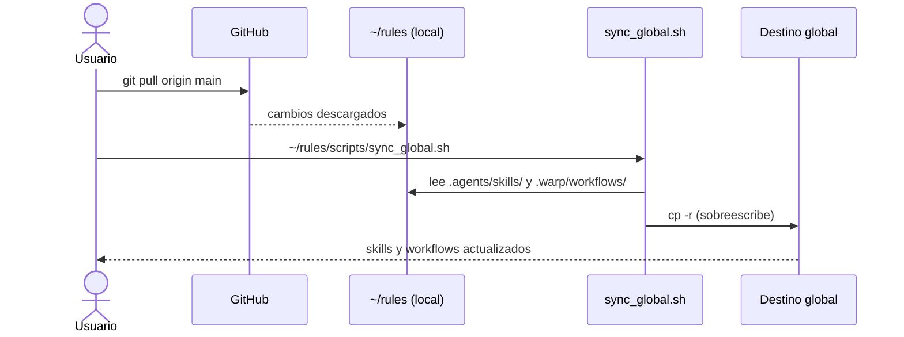

# Mecanismo de sincronización global

*Última modificación: 30 de marzo de 2026 (CST)*

Este documento describe en detalle cómo funciona `scripts/sync_global.sh`: qué copia, a dónde lo copia, cómo detecta la plataforma y por qué cada decisión de diseño existe.

## Propósito

Warp y otros agentes de IA descubren *skills* y *workflows* a partir de rutas fijas en el sistema de archivos del usuario. El repositorio `rules` los almacena versionados bajo `.agents/skills/` y `.warp/workflows/`, pero esas rutas solo son útiles dentro del propio repositorio. `sync_global.sh` resuelve esa brecha: copia los artefactos a las rutas globales que cada herramienta y plataforma espera.

## Qué se sincroniza y qué no

| Artefacto | ¿Se sincroniza? | Destino |
|-----------|-----------------|---------|
| *Skills* (`.agents/skills/*/SKILL.md`) | Sí | Varía por plataforma (ver tabla más abajo) |
| *Workflows* (`.warp/workflows/*.yaml`) | Sí | Varía por plataforma (ver tabla más abajo) |
| `scripts/` | No | Se accede directo desde `~/rules/scripts/` |
| `templates/` | No | Se accede directo desde `~/rules/templates/` |
| `rulesets/` | No | Se accede directo desde `~/rules/rulesets/` |
| `cot/` | No | Se accede directo desde `~/rules/cot/` |

Los artefactos que **no** se sincronizan no necesitan estar en una ruta global porque se referencian siempre con rutas canónicas del tipo `~/rules/rulesets/X.md`.

## Flujo general de ejecución



## Detección de la raíz del repositorio

El script determina su ubicación con:

```bash
SCRIPT_DIR="$(cd "$(dirname "$0")" && pwd)"
REPO_ROOT="$(cd "$SCRIPT_DIR/.." && pwd)"
```

Esto permite invocarlo desde cualquier directorio: tanto `./scripts/sync_global.sh` (desde la raíz del repo) como `~/rules/scripts/sync_global.sh` (desde cualquier lugar) producen el mismo resultado. Si la ruta calculada no contiene los directorios esperados, cae al respaldo `~/rules`.

## Detección de plataforma

La detección usa `uname -s` como base, con un caso especial para WSL dentro de la rama `Linux`:



La separación WSL/Linux es crítica: aunque `uname -s` devuelve `Linux` en ambos casos, Warp corre sobre **Windows** en un entorno WSL y necesita leer los *skills* desde el sistema de archivos de Windows, no del de Linux.

## Destinos por plataforma

### *Skills*

Los *skills* deben estar en una ruta que Warp (u otro agente) pueda descubrir globalmente. En WSL la ruta de Linux (`~/.agents/skills/`) es invisible para Warp, por lo que el destino es el *home* de Windows:



En WSL, el *home* de Windows se calcula en tiempo de ejecución:

```bash
WIN_HOME="$(wslpath "$(cmd.exe /C "echo %USERPROFILE%" 2>/dev/null | tr -d '\r')")"
SKILLS_DST="$WIN_HOME/.agents/skills"
```

`cmd.exe /C "echo %USERPROFILE%"` devuelve la ruta Windows (p. ej. `C:\Users\incognia`), y `wslpath` la convierte a la ruta Linux equivalente (`/mnt/c/Users/incognia`).

### *Workflows*

Los *workflows* de Warp tienen rutas distintas en cada plataforma, dictadas por las convenciones del sistema operativo:



> **Nota sobre WSL y *workflows*:** a diferencia de los *skills*, los *workflows* se sincronizan al *home* de Linux porque Warp los carga desde la sesión WSL activa, no desde Windows.

## Estructura copiada

Cada *skill* es un directorio con al menos un `SKILL.md`. El script copia el directorio completo, preservando cualquier archivo adicional (plantillas, scripts auxiliares):

```
.agents/skills/
├── commit/
│   └── SKILL.md          ← copiado íntegro a $SKILLS_DST/commit/
├── changelog/
│   └── SKILL.md
├── context/
│   └── SKILL.md
└── ...
```

Los *workflows* son archivos YAML planos copiados directamente al directorio destino:

```
.warp/workflows/
├── backup_file.yaml       ← copiado a $WORKFLOWS_DST/
├── commit_flow.yaml
├── cst_date.yaml
└── lint_markdown.yaml
```

## Flujo de actualización

Después de cualquier `git pull`, basta con volver a ejecutar el script. Como opera con `cp -r`, sobreescribe los archivos existentes sin necesidad de limpiar el destino manualmente:



## Modos de invocación

```bash
# Desde la raíz del repo clonado
./scripts/sync_global.sh

# Desde cualquier directorio (ruta canónica)
~/rules/scripts/sync_global.sh

# Sin clonar — ejecución remota directa
bash <(curl -sL https://raw.githubusercontent.com/incognia/rules/main/scripts/sync_global.sh)

# Actualización completa en un solo comando
git -C ~/rules pull && ~/rules/scripts/sync_global.sh
```

## Referencias

- Script fuente: [`scripts/sync_global.sh`](../scripts/sync_global.sh)
- *Skills* del repositorio: [`.agents/skills/`](../.agents/skills/)
- *Workflows* del repositorio: [`.warp/workflows/`](../.warp/workflows/)
- Configuración inicial: [`~/rules/README.md`](../README.md) — sección «Configuración inicial»
